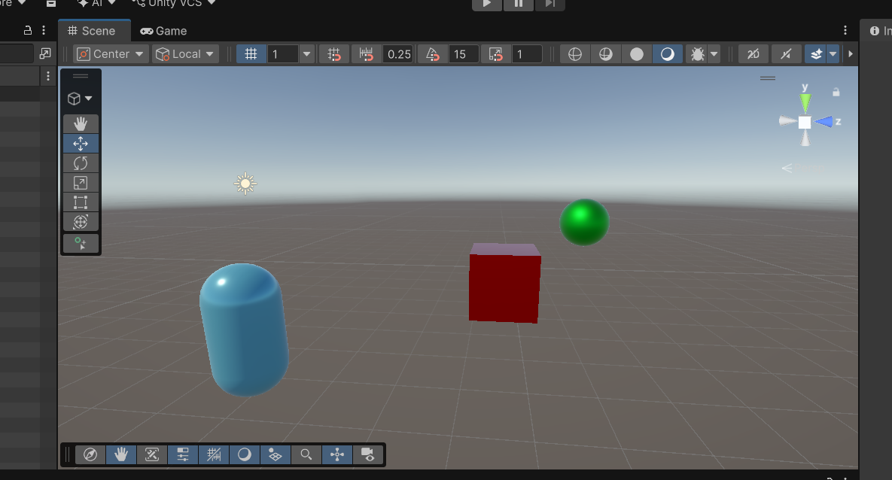
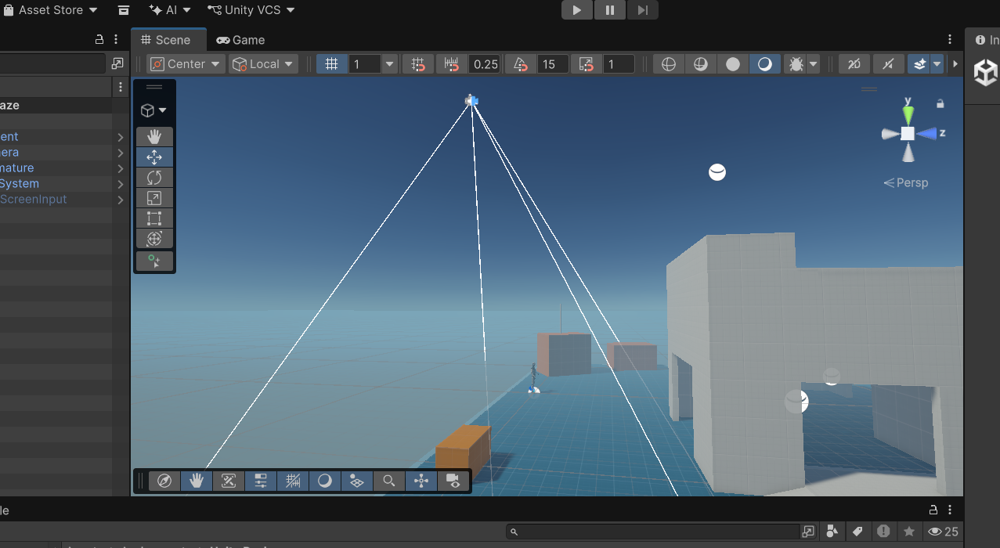
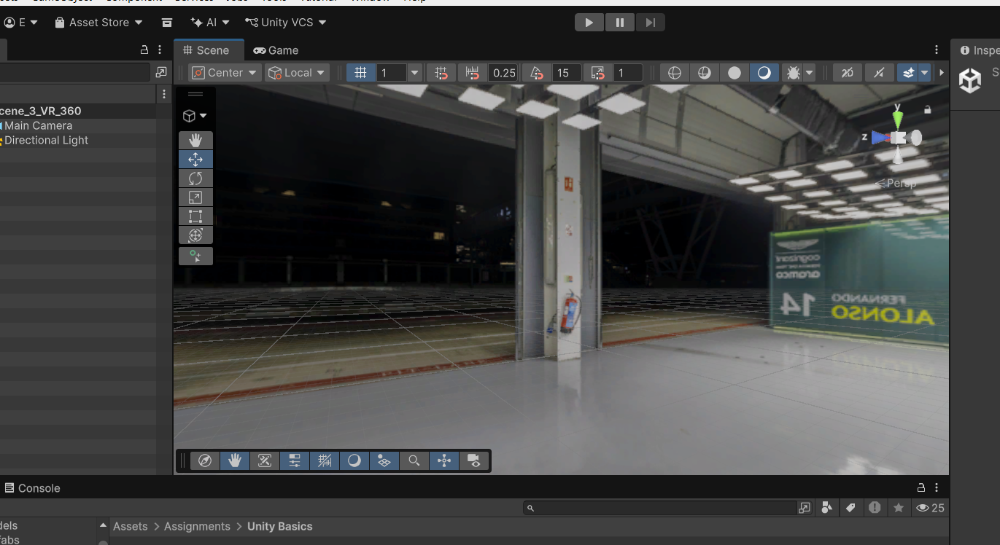

# CSC 461/592 – Assignment 1 Unity Basics

## Scene 1 – Unity Primitives
This scene demonstrates the fundamental use of Unity 3D primitives and custom material components. It features a cube, a sphere, and a capsule, each configured with a distinct, custom-colored material with unique albedo and surface smoothness attributes.

## Scene 2 – Maze
This scene contains a custom 3D maze environment built out of geometric wall assets. Players navigate through the corridors using an imported third-person character controller asset, observed from a fixed top-down Cinemachine drone perspective layout.

## Scene 3 – VR 360
This immersive, VR-ready scene utilizes an equirectangular 360-degree panoramic image texture mapped onto a custom global Skybox material layer, allowing users to look around and visualize a full wrap-around static virtual environment.

